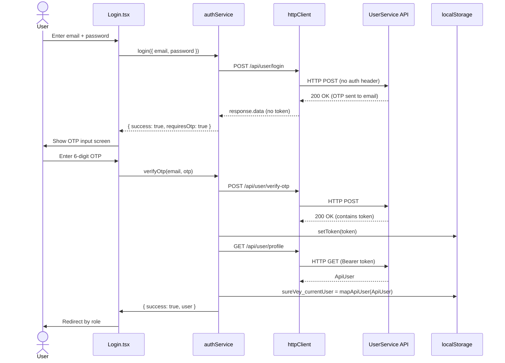
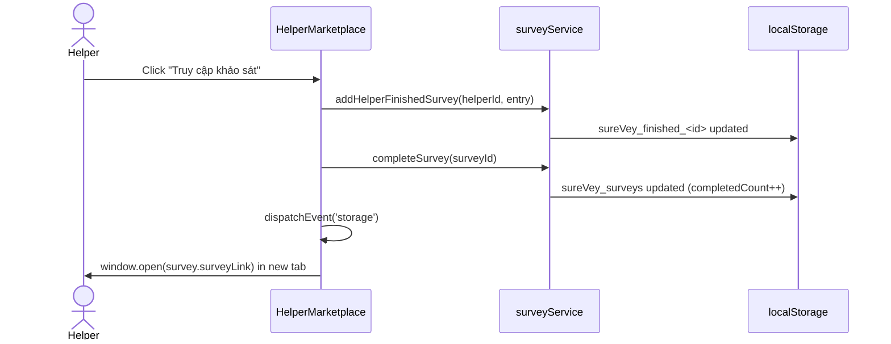
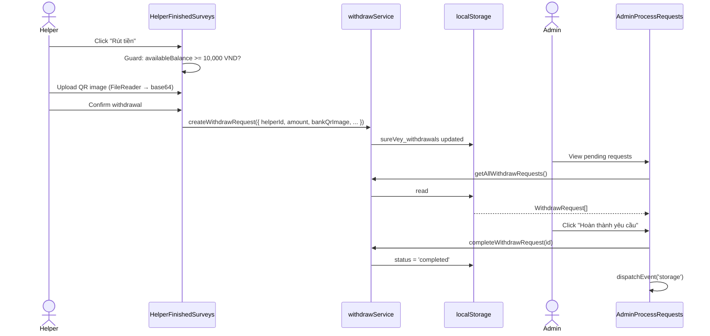

# Frontend Codebase Overview

> **Audience:** Incoming senior engineers  
> **Generated from:** Static analysis of `frontend/src/` — no information is invented; gaps are stated explicitly  
> **Base path:** All file paths are relative to `frontend/`

---

## Table of Contents

1. [Executive Summary](#1-executive-summary)
2. [Folder Tree](#2-folder-tree)
3. [Architecture Overview](#3-architecture-overview)
4. [Feature Map](#4-feature-map)
5. [Routing Map](#5-routing-map)
6. [State Management Map](#6-state-management-map)
7. [API Map](#7-api-map)
8. [Component Dependency Diagram](#8-component-dependency-diagram)
9. [Data Flow Diagram](#9-data-flow-diagram)
10. [TODO / FIXME Comments](#10-todo--fixme-comments)
11. [Dead Code & Unused Files](#11-dead-code--unused-files)
12. [Suggested Improvements](#12-suggested-improvements)

---

## 1. Executive Summary

SureVey is a Vietnamese survey marketplace that connects **survey owners** (businesses and researchers who pay to collect responses) with **helpers** (individuals who earn money by completing surveys). An **admin** role handles withdrawal request approvals.

The frontend is a **React 18 + TypeScript** single-page application built with **Vite 6**, styled via **Tailwind CSS 4** and a large set of pre-built **shadcn/ui (Radix UI)** primitives.

**Current integration status (as of this writing):**

| Concern | Backend | Local (localStorage) |
|---|---|---|
| User auth, profile | **UserService API** (`VITE_USER_API_URL`) | token + user cached |
| Surveys | — | **localStorage only** |
| Support tickets | — | **localStorage only** |
| Withdrawal requests | — | **localStorage only** |

Only the user/auth domain has been wired to a real REST API. The remaining three domains (`surveyService`, `supportService`, `withdrawService`) are prototype stubs backed entirely by `localStorage` and will need to be migrated to their respective microservices.

---

## 2. Folder Tree

```
frontend/
├── .env                          # VITE_USER_API_URL, VITE_SURVEY_API_URL, VITE_WALLET_API_URL, VITE_APP_URL
├── package.json
├── vite.config.ts                # Vite config; defines __dirname via import.meta.url; Tailwind + React plugins
├── tsconfig.json                 # TS project root — covers src/; moduleResolution: bundler
├── tsconfig.node.json            # TS config for vite.config.ts itself
│
└── src/
    ├── main.tsx                  # Entry point — mounts <App /> into #root
    ├── vite-env.d.ts             # /// <reference types="vite/client" /> — enables import.meta.env types
    │
    ├── styles/
    │   ├── index.css             # Barrel — imports fonts.css, tailwind.css, theme.css
    │   ├── fonts.css             # Font-face declarations (contents not inspected)
    │   ├── tailwind.css          # Tailwind directives (contents not inspected)
    │   └── theme.css             # CSS custom properties / design tokens (contents not inspected)
    │
    └── app/
        ├── App.tsx               # Root — RouterProvider + global <Toaster>
        ├── routes.ts             # createBrowserRouter config; all routes under Layout shell
        │
        ├── types/
        │   ├── auth.ts           # User, ApiUser, LoginRequest, VerifyOtpRequest, UserInfo, role maps
        │   ├── survey.ts         # Survey, SurveyQuestion, SurveyPackage enum, SURVEY_PACKAGES constant
        │   └── support.ts        # SupportTicket, DisputeTicket, FAQCategory, label maps
        │
        ├── api/                  # HTTP transport layer (UserService only)
        │   ├── httpClient.ts     # Axios instance + request/response interceptors
        │   └── userApi.ts        # Typed wrappers for every UserService endpoint
        │
        ├── services/             # Business logic + data access
        │   ├── authService.ts    # Async auth; reads cached user synchronously
        │   ├── surveyService.ts  # localStorage CRUD for surveys (no API yet)
        │   ├── supportService.ts # localStorage CRUD for support/dispute tickets (no API yet)
        │   └── withdrawService.ts# localStorage CRUD for withdrawal requests (no API yet)
        │
        └── components/
            ├── Layout.tsx            # App shell: sticky header, nav, footer, role switcher
            ├── Home.tsx              # Public landing page
            ├── Login.tsx             # Login form + OTP step + Google OAuth redirect
            ├── Signup.tsx            # Registration form
            ├── UserProfile.tsx       # View / edit current user's profile (calls real API)
            ├── OwnerDashboard.tsx    # Owner's survey list with cancel/delete
            ├── PostSurvey.tsx        # Create-survey form (external link or internal builder)
            ├── SurveyBuilder.tsx     # Step-by-step internal question editor
            ├── HelperMarketplace.tsx # Filterable list of open surveys
            ├── SurveyDoing.tsx       # Internal survey take-flow (one question per screen)
            ├── HelperFinishedSurveys.tsx # Helper earnings + withdrawal modal
            ├── FAQ.tsx               # Help centre: FAQ accordions + support/dispute forms
            ├── TicketStatus.tsx      # Ticket lookup by ID + "my tickets" list
            ├── AdminProcessRequests.tsx # Admin panel: approve withdrawal requests
            ├── Notification.tsx      # Reusable inline alert banner (not a toast)
            ├── NotFound.tsx          # 404 page
            ├── figma/
            │   └── ImageWithFallback.tsx #  wrapper with broken-image SVG fallback
            └── ui/                   # 46 shadcn/ui primitive components (Radix UI wrappers)
                ├── accordion.tsx, alert.tsx, alert-dialog.tsx, aspect-ratio.tsx
                ├── avatar.tsx, badge.tsx, breadcrumb.tsx, button.tsx, calendar.tsx
                ├── card.tsx, carousel.tsx, chart.tsx, checkbox.tsx, collapsible.tsx
                ├── command.tsx, context-menu.tsx, dialog.tsx, drawer.tsx
                ├── dropdown-menu.tsx, form.tsx, hover-card.tsx, input.tsx, input-otp.tsx
                ├── label.tsx, menubar.tsx, navigation-menu.tsx, pagination.tsx, popover.tsx
                ├── progress.tsx, radio-group.tsx, resizable.tsx, scroll-area.tsx, select.tsx
                ├── separator.tsx, sheet.tsx, sidebar.tsx, skeleton.tsx, slider.tsx
                ├── sonner.tsx, switch.tsx, table.tsx, tabs.tsx, textarea.tsx, toggle.tsx
                ├── toggle-group.tsx, tooltip.tsx
                ├── use-mobile.ts     # Mobile breakpoint hook (isMobile: boolean)
                └── utils.ts          # cn() — clsx + tailwind-merge helper
```

---

## 3. Architecture Overview

### Stack

| Layer | Technology |
|---|---|
| Framework | React 18.3.1 |
| Language | TypeScript (transpiled by Vite/esbuild; type-checked by TS server with tsconfig.json) |
| Bundler | Vite 6.4.3 |
| Routing | React Router 7 (`createBrowserRouter`) |
| Styling | Tailwind CSS 4 (`@tailwindcss/vite` plugin) |
| UI primitives | shadcn/ui (Radix UI + class-variance-authority) |
| HTTP client | Axios (auth domain only) |
| Toast notifications | Sonner |
| Icons | Lucide React |

### Layering model

```
┌───────────────────────────────────────────┐
│              React Components             │  Presentation + local state
├───────────────────────────────────────────┤
│              Service Layer                │  Business logic, data access
│  authService  surveyService  support…     │
├───────────────────────────────────────────┤
│              API / Transport Layer        │  HTTP (auth only)
│  httpClient.ts       userApi.ts           │
├───────────────────────────────────────────┤
│     External            localStorage      │
│  UserService API    (surveys, support,    │
│  (render.com)        withdraw — stubs)    │
└───────────────────────────────────────────┘
```

### Auth state synchronisation

There is no React Context or global state library. Auth state is stored in `localStorage` and propagated through a **custom storage-event bus**:

1. Any service that mutates auth state calls `window.dispatchEvent(new Event('storage'))`.
2. `Layout.tsx` listens on `window.addEventListener('storage', ...)` and re-reads `getCurrentUser()` to update its local state.
3. Other components follow the same pattern where auth-reactive re-rendering is needed.

This means auth state is **eventually consistent** across tabs but requires all mutation sites to dispatch the event manually.

---

## 4. Feature Map

| Feature | Role | Components | Service(s) |
|---|---|---|---|
| Public landing page | All / unauthenticated | `Home` | `authService` (read-only) |
| Registration | New users | `Signup` | `authService.signup` → UserService |
| Login (email + OTP) | All | `Login` | `authService.login`, `authService.verifyOtp` → UserService |
| Google OAuth | All | `Login`, `Signup` | redirect to `VITE_USER_API_URL/api/user/login-google` |
| View / edit profile | All authenticated | `UserProfile` | `authService.refreshProfile`, `authService.updateProfile` → UserService |
| Post survey (external) | Owner | `PostSurvey` | `surveyService.createSurvey` (localStorage) |
| Build internal survey | Owner | `PostSurvey` → `SurveyBuilder` | `surveyService.createSurvey` (localStorage) |
| Manage my surveys | Owner | `OwnerDashboard` | `surveyService` (localStorage) |
| Browse & accept surveys | Helper | `HelperMarketplace` | `surveyService` (localStorage) |
| Take internal survey | Helper | `SurveyDoing` | `surveyService` (localStorage) |
| View completed + earnings | Helper | `HelperFinishedSurveys` | `surveyService`, `withdrawService` (localStorage) |
| Request withdrawal | Helper | `HelperFinishedSurveys` (modal) | `withdrawService` (localStorage) |
| Approve withdrawals | Admin | `AdminProcessRequests` | `withdrawService` (localStorage) |
| FAQ / support form | Owner, Helper | `FAQ` | `supportService` (localStorage) |
| Dispute / fraud report | Owner, Helper | `FAQ` | `supportService` (localStorage) |
| Ticket status lookup | Owner, Helper | `TicketStatus` | `supportService` (localStorage) |

---

## 5. Routing Map

All routes are nested under the `Layout` shell component. There is **no route-level authentication guard** — each component checks `isAuthenticated()` in its own `useEffect` and imperatively redirects to `/login`.

```
/                         → Home
├── login                 → Login
├── signup                → Signup
├── profile               → UserProfile              [auth required]
│
├── owner/
│   ├── dashboard         → OwnerDashboard           [auth + role=owner]
│   ├── post              → PostSurvey               [auth + role=owner]
│   └── survey-builder    → SurveyBuilder            [auth + role=owner; reads localStorage draft]
│
├── helper/
│   ├── marketplace       → HelperMarketplace        [auth + role=helper]
│   ├── survey/:surveyId  → SurveyDoing              [auth + role=helper]
│   └── finished          → HelperFinishedSurveys    [auth + role=helper]
│
├── admin/
│   └── requests          → AdminProcessRequests     [auth + role=admin]
│
├── support/
│   ├── faq               → FAQ                      [open]
│   └── tickets           → TicketStatus             [open; shows user's tickets when logged in]
│
└── *                     → NotFound
```

**Note:** The role-based redirects in `Layout.tsx` after login (`/admin/requests`, `/owner/dashboard`, `/helper/marketplace`) are the primary access control. A helper who manually navigates to `/owner/dashboard` will see owner data for any user whose ID matches — there is no server-enforced authorisation in the frontend stubs.

---

## 6. State Management Map

There is **no global state library** (no Redux, Zustand, Jotai, or React Context). State is managed at three levels:

### Per-component state (`useState`)

Every page component manages its own data with `useState` + `useEffect` that reads from the service layer on mount.

| Component | Key state |
|---|---|
| `Layout` | `currentUser`, `authenticated` |
| `OwnerDashboard` | `surveys: Survey[]` |
| `PostSurvey` | `formData`, `errors` |
| `SurveyBuilder` | `draft`, `questions: SurveyQuestion[]` |
| `HelperMarketplace` | `surveys`, `filteredSurveys`, `filters: SurveyFilters` |
| `SurveyDoing` | `survey`, `currentIndex`, `answers`, `submitted` |
| `HelperFinishedSurveys` | `entries`, `totalEarned`, `availableBalance`, `withdrawOpen`, `qrBase64` |
| `FAQ` | `supportForm`, `disputeForm`, submission states |
| `TicketStatus` | `searchId`, `searchedTicket`, `showMyTickets` |
| `AdminProcessRequests` | `requests: WithdrawRequest[]`, `previewImg` |
| `UserProfile` | `user`, `form` (edit fields), loading flags |
| `Login` | `step ('login'|'otp')`, `formData`, `otp`, `pendingEmail` |
| `Signup` | `formData`, `error`, `isLoading` |
| `Notification` | `visible: boolean` |
| `ImageWithFallback` | `didError: boolean` |

### Persistent state (localStorage)

| Key | Owner | Format |
|---|---|---|
| `sureVey_token` | `httpClient.ts` | JWT string |
| `sureVey_currentUser` | `authService.ts` | JSON `User` object |
| `sureVey_surveys` | `surveyService.ts` | JSON `Survey[]` |
| `sureVey_finished_${helperId}` | `surveyService.ts` | JSON `FinishedEntry[]` |
| `sureVey_supportTickets` | `supportService.ts` | JSON `SupportTicket[]` |
| `sureVey_disputeTickets` | `supportService.ts` | JSON `DisputeTicket[]` |
| `sureVey_withdrawals` | `withdrawService.ts` | JSON `WithdrawRequest[]` |
| `surveyDraft` | `PostSurvey` → `SurveyBuilder` | JSON partial survey object |

### Cross-component synchronisation (storage event bus)

```
mutating service call
  └─► window.dispatchEvent(new Event('storage'))
        └─► Layout.tsx window.addEventListener('storage', handleStorageChange)
        └─► OwnerDashboard / HelperMarketplace / etc. — loadData() re-called
```

---

## 7. API Map

### UserService  (`VITE_USER_API_URL = https://suresurvey-user-service.onrender.com`)

All requests go through `src/app/api/httpClient.ts` (Axios instance).  
Authentication: `Authorization: Bearer <token>` header injected by request interceptor.  
A 401 response auto-clears the session and fires the storage event.

| Method | Endpoint | Auth required | Request body type | Response type | Used by |
|---|---|---|---|---|---|
| `POST` | `/api/user/register` | No | `ApiUser` | — | `authService.signup` |
| `POST` | `/api/user/login` | No | `LoginRequest` | unknown (token or empty) | `authService.login` |
| `POST` | `/api/user/verify-otp` | No | `VerifyOtpRequest` | unknown (token) | `authService.verifyOtp` |
| `GET` | `/api/user/login-google` | No | — | redirect | `Login`, `Signup` (href link) |
| `GET` | `/api/user/google-callback` | No | — | redirect + token | Browser (OAuth callback) |
| `GET` | `/api/user/profile` | **Yes** | — | `ApiUser` | `authService.login`, `verifyOtp`, `refreshProfile`, `updateProfile` |
| `PUT` | `/api/user/update` | **Yes** | `UserInfo` | — | `authService.updateProfile` |
| `GET` | `/api/user/getUser/{id}` | **Yes** | — | `ApiUser` | `userApi.getUserById` (not yet called from any component) |
| `GET` | `/api/user/members` | **Yes** | — | `ApiUser[]` | `userApi.getMembers` (not yet called from any component) |
| `GET` | `/api/user/paging` | **Yes** | `?PageIndex&PageSize` | `ApiUser[]` | `userApi.getUsersPaged` (not yet called from any component) |

**Token extraction strategy:** The `login` and `verifyOtp` responses carry an opaque `unknown` type. `authService.ts` probes `data.token`, `data.accessToken`, `data.jwt`, and the raw string value in that order.

### Survey / Support / Wallet APIs (`.env` declares URLs, not yet integrated)

| Variable | Value |
|---|---|
| `VITE_SURVEY_API_URL` | `https://suresurvey-survey-service.onrender.com` |
| `VITE_WALLET_API_URL` | `https://suresurvey-wallet-service.onrender.com` |

No code currently reads these variables. The survey, support, and withdrawal domains are served from `localStorage` stubs.

---

## 8. Component Dependency Diagram

```mermaid
graph TD
    main["main.tsx"] --> App

    App --> RouterProvider["RouterProvider (react-router)"]
    App --> Toaster["Toaster (sonner)"]
    RouterProvider --> Layout

    Layout --> Home
    Layout --> Login
    Layout --> Signup
    Layout --> UserProfile
    Layout --> OwnerDashboard
    Layout --> PostSurvey
    Layout --> SurveyBuilder
    Layout --> HelperMarketplace
    Layout --> SurveyDoing
    Layout --> HelperFinishedSurveys
    Layout --> FAQ
    Layout --> TicketStatus
    Layout --> AdminProcessRequests
    Layout --> NotFound

    Login --> InputOTP["InputOTP (ui/input-otp)"]
    HelperFinishedSurveys --> Notification
    UserProfile --> Avatar["Avatar (ui/avatar)"]
    UserProfile --> Separator["Separator (ui/separator)"]

    subgraph "shadcn/ui primitives (ui/)"
        InputOTP
        Avatar
        Separator
        Button["button"]
        Card["card"]
        Badge["badge"]
        Dialog["dialog"]
        Progress["progress"]
        Select["select"]
        Accordion["accordion"]
        Alert["alert"]
        RadioGroup["radio-group"]
        Input["input"]
        Label["label"]
        Textarea["textarea"]
    end

    subgraph "Service layer"
        authService
        surveyService
        supportService
        withdrawService
    end

    subgraph "API layer"
        httpClient --> UserServiceAPI["UserService API\n(render.com)"]
        userApi --> httpClient
        authService --> userApi
    end

    surveyService --> localStorage[("localStorage")]
    supportService --> localStorage
    withdrawService --> localStorage
    authService --> localStorage

    Home --> authService
    Login --> authService
    Signup --> authService
    UserProfile --> authService
    Layout --> authService
    OwnerDashboard --> surveyService
    PostSurvey --> surveyService
    SurveyBuilder --> surveyService
    HelperMarketplace --> surveyService
    SurveyDoing --> surveyService
    HelperFinishedSurveys --> surveyService
    HelperFinishedSurveys --> withdrawService
    FAQ --> supportService
    TicketStatus --> supportService
    AdminProcessRequests --> withdrawService
```



---

## 9. Data Flow Diagram

### Auth flow (login with OTP)



### Survey completion flow (external survey)



### Withdrawal request flow



---

## 10. TODO / FIXME Comments

**None found.** A full-text search across all `.ts` and `.tsx` files under `src/` returned zero `TODO`, `FIXME`, `HACK`, or `XXX` markers.

---

## 11. Dead Code & Unused Files

### Confirmed unused exports (userApi.ts)

Three `userApi` methods are defined but never called from any component or service:

| Method | Endpoint |
|---|---|
| `userApi.getUserById(id)` | `GET /api/user/getUser/{id}` |
| `userApi.getMembers()` | `GET /api/user/members` |
| `userApi.getUsersPaged(params)` | `GET /api/user/paging` |

These are exposed for future use (admin user management) but have no callers yet.

### Duplicate `UserRole` type definition

`src/app/types/survey.ts` exports its own `UserRole`:

```ts
// survey.ts
export type UserRole = 'owner' | 'helper';   // ← missing 'admin'
```

This conflicts with the canonical definition in `src/app/types/auth.ts`:

```ts
// auth.ts
export type UserRole = 'owner' | 'helper' | 'admin';
```

The `survey.ts` version is never imported anywhere — all components import `UserRole` from `auth.ts`. The `survey.ts` definition is dead code and should be removed.

### `figma/ImageWithFallback.tsx`

Not imported by any currently active page component. It may have been used by Figma-generated screens that were replaced with hand-written components. Cannot confirm deletion is safe without checking git history for prior callers.

### `ui/sidebar.tsx`, `ui/chart.tsx`, `ui/carousel.tsx`, `ui/calendar.tsx`, `ui/breadcrumb.tsx`

These are generated shadcn/ui components that are not imported by any business component (based on grep of import statements). They are harmless but inflate the bundle. The build already produces a 589 kB JS chunk (gzipped: 182 kB), which triggers a Vite chunk-size warning.

---

## 12. Suggested Improvements

### Critical (correctness / security)

1. **Migrate survey, support, and wallet domains to real APIs.**  
   `surveyService`, `supportService`, and `withdrawService` write to `localStorage`. This means data is siloed per browser, shared across no users, and lost on a clear. The `.env` already declares `VITE_SURVEY_API_URL` and `VITE_WALLET_API_URL` — follow the same pattern used for auth: add `src/app/api/surveyApi.ts`, etc., and replace the localStorage reads/writes in each service.

2. **Add server-side route guards.**  
   Any authenticated user can manually type `/owner/dashboard` or `/admin/requests` and reach those views. Real access control requires the backend to enforce ownership. At minimum, add a shared `<RequireRole>` wrapper component that reads the token's decoded role rather than the cached localStorage value.

3. **Role ID mapping is assumed, not verified.**  
   `ROLE_FROM_ID = { 1: 'owner', 2: 'helper', 3: 'admin' }` is hard-coded. If the backend seeds roles differently (e.g. `1=admin`), every user will get the wrong role after login. Fetch the `role.roleName` from the `ApiUser.role` object that the backend already returns, and derive the frontend role string from that string rather than the integer.

4. **`surveyDraft` localStorage key is never cleaned up on error.**  
   If `SurveyBuilder` encounters an error before calling `createSurvey`, the draft remains and the next visit to `/owner/post` may silently load stale data. Add a cleanup call in the error path.

### Architecture

5. **Introduce React Context (or Zustand) for auth state.**  
   Passing auth state via `window.dispatchEvent(new Event('storage'))` is fragile and hard to test. An `AuthContext` wrapping `RouterProvider` would let every component read `currentUser` without re-implementing the storage listener.

6. **Add a shared `ProtectedRoute` component.**  
   Each of the 10 protected page components duplicates the same `useEffect` redirect pattern. Extract it:
   ```tsx
   // components/ProtectedRoute.tsx
   export function ProtectedRoute({ role, children }: { role?: UserRole; children: ReactNode }) {
     const navigate = useNavigate();
     const user = getCurrentUser();
     useEffect(() => {
       if (!isAuthenticated()) navigate('/login');
       else if (role && user?.role !== role) navigate('/');
     }, []);
     return <>{children}</>;
   }
   ```

7. **Add an error boundary.**  
   No `<ErrorBoundary>` exists anywhere in the tree. An uncaught render error in one component will unmount the entire app with a blank screen.

### Performance

8. **Code-split large routes.**  
   The single 589 kB JS bundle triggers a Vite warning. Use `React.lazy` + `Suspense` for route components:
   ```ts
   const OwnerDashboard = lazy(() => import('./components/OwnerDashboard'));
   ```

9. **Remove unused shadcn/ui components from the bundle.**  
   `ui/sidebar.tsx`, `ui/chart.tsx`, `ui/carousel.tsx`, `ui/calendar.tsx`, and `ui/breadcrumb.tsx` appear to be unused. Tree-shaking should eliminate them if they are never imported, but confirm with a bundle analyser (`vite-bundle-visualizer`).

### Developer experience

10. **Add a TypeScript type-check step to the build.**  
    Vite uses esbuild for transpilation and silently ignores type errors. Add `tsc --noEmit` to the `build` script:
    ```json
    "build": "tsc --noEmit && vite build"
    ```

11. **Remove the duplicate `UserRole` from `survey.ts`.**  
    Import from `auth.ts` instead (or keep a single source of truth in `types/index.ts`).

12. **Document the role ID contract with the backend team.**  
    The integer ↔ string role mapping (`1=owner, 2=helper, 3=admin`) is an implicit contract. Add it to the backend's OpenAPI `components.schemas.Role` or agree on using `roleName` strings end-to-end.
